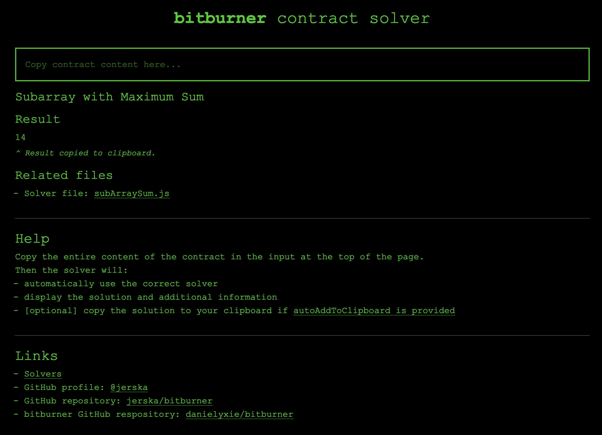

# Jerska's bitburner space

[bitburner](https://github.com/danielyxie/bitburner/) is an online idle game where most aspects can be automated through JS code.

This repository is my personal collection of scripts & tools used in my bitburner game.

## Notes

The repository has a lot of files at the root.  
This is due to the fact that bitburner doesn't support relative imports.

## Tools

### Contract solver

<a href="https://jerska.github.io/bitburner/">
<p align="center">

</p>
<p align="center">
<em>Contract solver</em>
</p>
</a>

This page is an online tool to solve any contract of the game.
It is meant to be used before programmatic solving is doable (i.e. not enough RAM in home).

The page provides an input in which to copy the entire contract content.
Once pasted, the correct solver is taken and the solution displayed (and optionally copied to your clipboard).

## Setup

To setup your bitburner game with all the scripts and aliases of this repository, run:

```sh
alias gpl="run command.gitPull.js";
alias info="run command.info.js";
wget https://raw.githubusercontent.com/jerska/bitburner/main/json.files.txt json.files.txt;
wget https://raw.githubusercontent.com/jerska/bitburner/main/utils.args.js utils.args.js;
wget https://raw.githubusercontent.com/jerska/bitburner/main/utils.data.js utils.data.js;
wget https://raw.githubusercontent.com/jerska/bitburner/main/utils.daemon.js utils.daemon.js;
wget https://raw.githubusercontent.com/jerska/bitburner/main/utils.log.js utils.log.js;
wget https://raw.githubusercontent.com/jerska/bitburner/main/command.gitPull.js command.gitPull.js;
```

Then:

```sh
gpl
```
